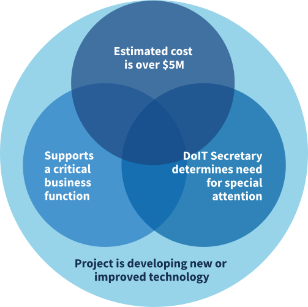

# Major IT Development Project (MITDP) Oversight

Our MITDP Oversight team oversees the planning, execution, and implementation of Major Information Technology Development Projects (MITDPs) across Maryland state agencies. Our oversight processes seek to ensure user-centered, iterative service delivery that reduces risk and maximizes value for the people of Maryland.

## What is an MITDP? {.image-right}

Established in law since 2002, MITDPs are IT development projects that meet any one or more of the program criteria.

The most relevant criteria in practice are:

- Is the project a development project?
- Is the project estimated to cost more than $5M?

MITDP funds cannot pay for ongoing operating costs, software or hardware maintenance, routine upgrades, or modifications that merely allow for a continuation of the existing level of functionality.

## MITDP Resources {.card-grid}

| [Dashboard](http://mitdp.maryland.gov) Data on the schedules, costs, and progress of all current MITDPs | [Oversight Process](https://maryland-gov.github.io/mitdp/oversight-process) Operational processes, including oversight requirements, policies, guidance, and how to become a new MITDP |
| :---- | :---- |
| [System Development Life Cycle (SDLC)](https://maryland-gov.github.io/mitdp/sdlc) Our updated SDLC ensures user-centered, iterative service delivery to reduce risk and maximize value for the people of Maryland | [Launchpad](https://maryland-gov.github.io/mitdp/launchpad) The Launchpad supports our SDLC to ensure that projects are clearly defined and have plans for implementation that are highly likely to succeed |
| [Staffing Requirements](https://maryland-gov.github.io/mitdp/staffing-requirements) Effective July 2026, all MITDPs must be staffed with specific leadership roles to ensure successful project outcomes | |
